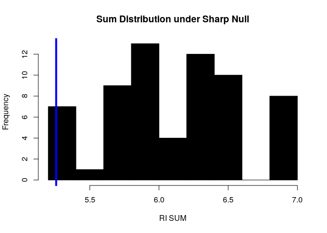

Problem Set 2
================
Experiments and Causality

``` r
estimate_ate <- function(dt, outcome, treatment, treat_val) { 
  ## This takes a data.table, the name of the outcome variable, and the name
  ## of the treatment indicator. 
  
  g <- dt[ , .(group_mean = mean(get(outcome))), keyby = .(get(treatment))]
  ate <- g[ , diff(group_mean)]
  
  return(ate) 
}
```

1. What happens when pilgrims attend the Hajj pilgrimage to Mecca?
==================================================================

On the one hand, participating in a common task with a diverse group of pilgrims might lead to increased mutual regard through processes identified in *Contact Theories*. On the other hand, media narritives have raised the spectre that this might be accompanied by "antipathy toward non-Muslims". [Clingingsmith, Khwaja and Kremer (2009)](https://dash.harvard.edu/handle/1/3659699) investigates the question.

Using the data here, test the sharp null hypothesis that winning the visa lottery for the pilgrimage to Mecca had no effect on the views of Pakistani Muslims toward people from other countries. Assume that the Pakistani authorities assigned visas using complete random assignment. Use, as your primary outcome the `views` variable, and as your treatment feature `success`. If you're ambitious, write your fucntion generally so that you can also evaluate feeligns toward specific nationalities.

``` r
d <- fread("./data/clingingsmith_2009.csv")
head(d)
```

    ##    success views_saudi views_indonesian views_turkish views_african
    ## 1:       0           1                1             0             0
    ## 2:       0           1                1             0            -1
    ## 3:       0           0                0             0             0
    ## 4:       0           2                2             0             0
    ## 5:       0           1                1             1             1
    ## 6:       0           2                0             0             0
    ##    views_chinese views_european views
    ## 1:             0              0     2
    ## 2:             1             -1     1
    ## 3:             0              0     0
    ## 4:             1              0     5
    ## 5:             1             -2     3
    ## 6:             0              0     2

1.  Using either `dplyr` or `data.table`, group the data by `success` and report whether views toward others are generally more positive among lottery winners or lottery non-winners.

    ``` r
    ate <- estimate_ate(d, outcome = 'views', treatment = 'success')
    ate
    ```

        ## [1] 0.4748337

    **We have an estimated treatment effect of 0.4748337, which seems to suggest that winning the lottery causes people to have more positive view of other groups.**

2.  But is this a meaningful difference, or could it just be randomization noise? Conduct 10,000 simulated random assignments under the sharp null hypothesis to find out. (Don't just copy the code from the async, think about how to write this yourself.)

    ``` r
    simulate_exp <- function(exp_d, outcome, treatment, sim_num = 10000) {
      results <- NA
      for (i in 1:sim_num) {
        exp_d <- exp_d[, new_treatment := sample(get(treatment))]
        results[i] <- estimate_ate(exp_d, outcome = outcome, treatment = "new_treatment")
      }
      results
    }
    ```

    ``` r
    sim_num = 10000
    sims <- simulate_exp(d, outcome = "views", treatment = "success", sim_num = sim_num)
    p_value <- mean(abs(sims) >= abs(ate))
    p_value
    ```

        ## [1] 0.0032

    **When we use randomized inference method with 10,000 simulated random assignments, we get a two-tailed p-value of 0.0032 under the sharp null hypothesis. Since it is well below 0.05, I think the difference probably didn't happen by chance.**

3.  How many of the simulated random assignments generate an estimated ATE that is at least as large as the actual estimate of the ATE?

    ``` r
    num_larger <- sum(sims >= ate)
    num_larger
    ```

        ## [1] 15

    Please, make sure that you include your result into the printed space using the **15** inline code idiom for this, and all other answers.

    **15 of the simulated ATE estimates are at least as large as our actual estimated ATE.**

4.  What is the implied *one-tailed* p-value?

    ``` r
    p_value_one_tailed <- num_larger / 10000
    p_value_one_tailed
    ```

        ## [1] 0.0015

    **The implied one-tailed p-value is 0.0015.**

5.  How many of the simulated random assignments generate an estimated ATE that is at least as large *in absolute value* as the actual estimate of the ATE?

    ``` r
    number_more_extreme <- sum(abs(sims) >= abs(ate))
    number_more_extreme
    ```

        ## [1] 32

    **32 of the simulated ATE estimates are at least as large in absoluate value as our actual estimated ATE.**

6.  What is the implied two-tailed p-value?

    ``` r
    p_value_two_tailed <- number_more_extreme / 10000
    ```

    **The implied two-tailed p-value is 0.0032.**

2. Randomization Inference Practice
===================================

McElhoe and Conner (1986) suggest using a *new* instrument called a "Visiplume" measure pollution. The EPA has a standard method for measuring pollution. Because they're good scientists, McElhoe and Conner want to validate that their instrument is measuring the same levels of pollution as the EPA instrument.

To do so, they take six readings -- one with each instrument -- at a single site. The recorded response is the ratio of the Visiplume reading to the EPA standard reading, and the values that are recorded are: 0.950, 0.978, 0.762, 0.733, 0.823, and 1.011.

Suppose that we want to test the question, "Do the Visiplume readings and the EPA standard readings produce similar enough estimates?"

> (The point of this question is to demonstrate that randomization inference works as a general inferrential paradigm, without *necessairily* being tied to an experiment.)

1.  How would you structure the sharp-null hypothesis -- that Visiplume and the EPA reaings are the same -- in this case? **If the sharp-null hypothesis is true (i.e., the two instruments' measures are equivalent), Visiplume could have measured that what EPA standard method had measured and vice versa. For the first example, Visiplume's measure is EPA's measure times 0.95. The counter factual wasn't observed under the sharp null is that EPA's measure is Visiplume's measure times 0.95. Therefore, what could have been observed under the sharp-null are the reciprocals of the observed values, which are: 1/0.950, 1/0.978, 1/0.762, 1/0.733, 1/0.823, and 1/1.011.**

2.  Suppose that our summary of the data is the sum of the ratios. That is, in the test that we conducted, we obsered 0.95 + ... + 1.011 = 5.257. Using randomization inference, test the sharp-null hypothesis that you formed in the first part of the question. Produce a histogram of the test statistic under the sharp null that compares against the 5.257 value from the test, and also produce a two-sided p-value.

    ``` r
    dt_ratios <- data.table(y_1 = c(0.950, 0.978, 0.762, 0.733, 0.823, 1.011))
    dt_ratios[, y_0 := 1/y_1]
    est_sum = sum(dt_ratios[, y_1])

    # simluate all 64 treatment regimes
    simulations <- NA
    treatment <- rep(0,6)
    for (i in 1:64) {
      for (j in 1:6) {
        treatment[j] <- treatment[j] + 1
        if (treatment[j] < 2) {
          break
        } else{
          treatment[j] <- 0
        }
      }
      simulations[i] <- sum(dt_ratios[, y_0] * (1 - treatment) + dt_ratios[, y_1] * treatment)
    }

    hist(
      abs(simulations), 
      col = 'black', 
      xlab = 'RI SUM', 
      main = 'Sum Distribution under Sharp Null'
      )
    abline(v = est_sum, col = 'blue', lwd = 4)
    ```

    

    ``` r
    simulation_mean = mean(simulations)
    p_value <- mean(abs(simulations - simulation_mean) >= abs(est_sum - simulation_mean))
    p_value
    ```

        ## [1] 0.046875

    **The two-sided p-value is 0.046875**

3. Term Limits Aren't Good.
===========================

Naturally occurring experiments sometimes involve what is, in effect, block random assignment. For example, [Rocio Titiunik](https://sites.google.com/a/umich.edu/titiunik/publications) , in [this paper](http://www-personal.umich.edu/~titiunik/papers/Titiunik2016-PSRM.pdf) studies the effect of lotteries that determine whether state senators in TX and AR serve two-year or four-year terms in the aftermath of decennial redistricting. These lotteries are conducted within each state, and so there are effectively two distinct experiments on the effects of term length.

The "thoery" in the news (such as it is), is that legislators who serve 4 year terms have more time to slack off and not produce legislation. If this were true, then it would stand to reason that making terms shorter would increase legislative production.

One way to measure legislative production is to count the number of bills (legislative proposals) that each senator introduces during a legislative session. The table below lists the number of bills introduced by senators in both states during 2003.

``` r
library(foreign)

d <- read.dta('./data/titiunik_2010.dta')
d <- data.table(d)
```

1.  Using either `dplyr` or `data.table`, group the data by state and report the mean number of bills introduced in each state. Does Texas or Arkansas seem to be more productive? Then, group by two- or four-year terms (ignoring states). Do two- or four-year terms seem to be more productive? **Which of these effects is causal, and which is not?** Finally, using `dplyr` or `data.table` to group by state and term-length. How, if at all, does this change what you learn?

    ``` r
    by_state = d[, .(mean_bill_intro = mean(bills_introduced)), keyby=.(texas0_arkansas1)]
    by_state
    ```

        ##    texas0_arkansas1 mean_bill_intro
        ## 1:                0        68.77419
        ## 2:                1        25.51429

    **At the first glance, Texas seems to be more efficient in introducing bills with 68.7741935 bills on averge which is more than the average of 25.5142857 by Arkansas.**

    ``` r
    by_term = d[, .(mean_bill_intro = mean(bills_introduced)), keyby=.(term2year)]
    by_term
    ```

        ##    term2year mean_bill_intro
        ## 1:         0        53.09091
        ## 2:         1        38.57576

    **When grouping by term length, four-year terms seem to be more efficient with 53.0909091 bills introduced on average; whereas, for two-year terms, only 38.5757576 bills were introduced on average.** **However, I think only the by-term grouping gives us insight into causal relationship because only term lengths were randomly assigned in this case.**

    ``` r
    by_both = d[, .(mean_bill_intro = mean(bills_introduced), count = .N)
                , keyby=.(texas0_arkansas1, term2year)]
    by_both
    ```

        ##    texas0_arkansas1 term2year mean_bill_intro count
        ## 1:                0         0        76.87500    16
        ## 2:                0         1        60.13333    15
        ## 3:                1         0        30.70588    17
        ## 4:                1         1        20.61111    18

    **Even after grouping by both state and term length, within each state, we still see four-year terms being more efficient than two-year terms. However, if we look at the ATE of two-year term by state: **

    ``` r
    state_ate = by_both[, .(ate_est = diff(mean_bill_intro), count=sum(count))
                        , keyby = .(texas0_arkansas1)]
    state_ate
    ```

        ##    texas0_arkansas1   ate_est count
        ## 1:                0 -16.74167    31
        ## 2:                1 -10.09477    35

    **It's worth noting that the ATE of two-year term is actually correlated with states. The magnitude of ATE is bigger for Texas.**

2.  For each state, estimate the standard error of the estimated ATE.

    ``` r
    # Use formula 3.6 to estimate the SE for ATE within each state block
    se_ate <- d[, .(var = var(bills_introduced), 
                    count = .N, 
                    var_over_count = var(bills_introduced)/.N)
                , keyby=.(texas0_arkansas1, term2year)]
    se_ate <- se_ate[, .(se = sqrt(sum(var_over_count)), count=sum(count))
                     , keyby=.(texas0_arkansas1)]
    se_ate[, .(texas0_arkansas1, se)]
    ```

        ##    texas0_arkansas1       se
        ## 1:                0 9.345871
        ## 2:                1 3.395979

3.  Use equation (3.10) to estimate the overall ATE for both states combined.

    ``` r
    overall_ate <- state_ate[, sum(count * ate_est)] / sum(state_ate[,count])
    overall_ate
    ```

        ## [1] -13.2168

    **The overall ATE is -13.2167979**

4.  Explain why, in this study, simply pooling the data for the two states and comparing the average number of bills introduced by two-year senators to the average number of bills introduced by four-year senators leads to biased estimate of the overall ATE.

    ``` r
    by_both
    ```

        ##    texas0_arkansas1 term2year mean_bill_intro count
        ## 1:                0         0        76.87500    16
        ## 2:                0         1        60.13333    15
        ## 3:                1         0        30.70588    17
        ## 4:                1         1        20.61111    18

    **From this table above, we can see that Arkansas has lower potential outcomes but a higher chance to be selected for treatment (18/35 &gt; 15/31). Therefore, if we just pool together all the observations to calculate the overall ATE estimate, we would have lower estimated potential outcome to treatment and higher estimated potential outcome to control. Therefore, underesimate the overall ATE. -14.5151515 &lt; -13.2167979**

5.  Insert the estimated standard errors into equation (3.12) to estimate the stand error for the overall ATE.

    ``` r
    se_overall_ate <- se_ate[, total_count := sum(se_ate[,count])]
    se_overall_ate <- se_overall_ate[, sqrt(sum(se^2 * (count/total_count)^2))]
    se_overall_ate
    ```

        ## [1] 4.74478

    **The estimated overall standard error is 4.7447803**

6.  Use randomization inference to test the sharp null hypothesis that the treatment effect is zero for senators in both states. Here we mean: estimate the *overall ate* (which is, the weighted average of the block ate) as the internal part of your RI loop.

    ``` r
    tx_treatment <- d[texas0_arkansas1 == 0, term2year]
    ar_treatment <- d[texas0_arkansas1 == 1, term2year]

    sim_num <- 10000

    sim <- copy(d)
    simulations <-NA
    for (i in 1:sim_num) {
      sim <- sim[texas0_arkansas1 == 0, term2year := sample(tx_treatment)]
      sim <- sim[texas0_arkansas1 == 1, term2year := sample(ar_treatment)]
      by_both = sim[, .(mean_bill_intro = mean(bills_introduced), count=.N)
                    , keyby = .(texas0_arkansas1, term2year)]
      state_ate = by_both[, .(ate_est = diff(mean_bill_intro), count=sum(count))
                          , keyby = .(texas0_arkansas1)]
      simulations[i] <- state_ate[, sum(count * ate_est)] / sum(state_ate[,count])
    }
    p_value <- mean(abs(simulations) > abs(overall_ate))
    p_value
    ```

        ## [1] 0.0065

    **The two-sided p-value is 0.0065**

7.  **IN Addition:** Plot histograms for both the treatment and control groups in each state (for 4 histograms in total). Try using `ggplot` together with the `geom_histogram` geometry.

    ``` r
    state_names = c("Texas", "Arkansas")
    terms = c("Four Year Term", "Two Year Term")

    for (state in 0:1) { 
      for (treatment in 0:1) {
        target_d <- d[texas0_arkansas1 == state & term2year == treatment,]
        plot <- ggplot(target_d, aes(x=bills_introduced)) +
                       geom_histogram(binwidth = 5) + 
                       xlim(c(0, 150)) + 
                       ylim(c(0,5)) + 
                       ggtitle(paste(state_names[state+1], "-", terms[treatment+1])) +
                       theme(plot.title = element_text(size = 20, face = "bold"))
        print(plot)
      }
    }
    ```

    

4. Cluster Randomization
========================

Use the data in the table below to explore the consequences of cluster random assignment. (Assume that there are three clusters in treatment and four clusters in control.) Note that there is no randomization inference that is necessary to complete this problem because we have observed the *impossible* **science table**.

``` r
## load data 
d <- fread('./data/clustering_data.csv')
d
```

    ##     id y0 y1
    ##  1:  0  0  0
    ##  2:  1  2  0
    ##  3:  2  2  1
    ##  4:  3  4  4
    ##  5:  4  5  0
    ##  6:  5  6  0
    ##  7:  6  7  3
    ##  8:  7  9  3
    ##  9:  8 14 12
    ## 10:  9 15  8
    ## 11: 10 16  8
    ## 12: 11 17 15
    ## 13: 12 17  6
    ## 14: 13 19 17

1.  Suppose the clusters are formed by grouping observations {1,2}, {3,4}, {5,6}, ... , {13,14}. Use equation (3.22) to calculate the standard error. Note that, because we have the full schedule of potential outcomes -- the science table -- it is possible to estimate *c**o**v*(*Ȳ*<sub>*j*</sub>(0),*Ȳ*<sub>*j*</sub>(1)). If we did not posess this information, then we would need to work with equation 3.23.

    ``` r
    clustered_se <- function(dt, m, N) {
      ## tell us what you're doing
      # Calculate custer mean potential outcomes
      dt <- dt[, .(y0_mean = mean(y0), y1_mean = mean(y1)), keyby = .(cluster)]
      # Calculate the variance of the means of cluster potential outcome to control
      y0_mean_var = var(dt[, y0_mean])
      # Calculate the variance of the means of cluster potential outcome to treatment
      y1_mean_var = var(dt[, y1_mean])
      # Calculate the covariance of the means of cluster potential outcomes
      y0_y1_mean_cov = cov(dt[, y0_mean], dt[, y1_mean])

      # print(y0_mean_var)
      # print(y1_mean_var)
      # print(y0_y1_mean_cov)

      # Calculate the overall standard error
      clustered_se <- sqrt(1 / (dt[, .N] - 1) 
                           * (m * y0_mean_var / (N-m) 
                              + (N-m) * y1_mean_var / m 
                              + 2 * y0_y1_mean_cov))
      return(clustered_se)
    }
    ```

    ``` r
    dt <- d[, cluster := rep(1:(nrow(d)/2), each = 2)]
    overall_se <- clustered_se(dt, 3*2, 7*2)
    overall_se
    ```

        ## [1] 4.854122

    **The overall SE is 4.854122**

2.  Suppose that clusters are instead formed by grouping observations {1,14}, {2,13}, {3,12}, ... , {7,8}. Use equation (3.22) to calculate the standard error assuming half of the clusters are randomly assigned to treatment.

    ``` r
    dt <- d[, cluster := c(1:(nrow(d)/2), rev(1:(nrow(d)/2)))]
    overall_se <- clustered_se(dt, 3*2, 7*2)
    overall_se
    ```

        ## [1] 1.177529

    **The overall SE is 1.1775288**

3.  Why do the two methods of forming clusters lead to different standard errors? What are the implications for the design of cluster randomized experiments? **The second clustering design decreases the differences in potential outcomes between clusters. Therefore, as a direct result, the variances and covariance of clusters' average potential outcomes decreased. Looking at eq (3.22), since the three main terms decreased while k, m, N remained the same, the overall standard error decreased. The takeaway is: If there are high variations between clusters in their average potential outcomes, this will decrease the precision of our estimation and the power of our experiment.**

<!-- 

The "Sell Phones" question is presently optional. 

# 5. Sell Phones? 

Suppose that you are working for a company that sells online display advertisements. (The generation's smartest minds, lost to chasing those clicks...) On client, a consumer electronics company is considering using your ad network to run a large campaign. In order to evaluate its effectiveness, they want to run a smaller experiment to estimate the causal impact of the ads on sales of one of their smartphones. 

**The facts** 

- The experiment campaign will run for one week within a randomly samples sub-population of 800,000 users
- The cost per *impression* -- someone seeing the ad -- is $0.20. 
- The client tells you that they make a profit of \$100 every time someone purchases one of their smarphones (e.g. the device costs \$400 to manufacture, and are sold for \$500.)
- When they are **not** running the advertising campaign, the historic rate of purchasing has been that 0.004 of the population (0.4%) makes a purchase of this smartphone. 
- Assume that everyone who is assigned to the treatment group actually sees the ad. 
- Suppose there are no long-run effects and all the effects are measured within that week.


a. How large does the treatment effect need to be in order for the campaign to have positive value for the company? 


b. Suppose the measured effect were to be 0.3 percentage points. If users are split 50:50 between the treatment group (exposed to iPhone ads) and control group (exposed to unrelated advertising or nothing; something you can assume has no effect), what will be the confidence interval of your estimate on whether people purchase the phone?


  + **Hint:** The standard error for a two-sample proportion test is $\sqrt{p(1-p)*(\frac{1}{n_{1}}+\frac{1}{n_{2}})}$ where $p=\frac{x_{1}+x_{2}}{n_{1}+n_{2}}$, where $x$ and $n$ refer to the number of “successes” (here, purchases) over the number of “trials” (here, site visits). The length of each tail of a 95% confidence interval is calculated by multiplying the standard error by 1.96.
  
c. Based on this confidence interval, if the effect were 0.3 percentage points, would you recommend running the production campaign among the whole population? Why or why not?

d. Your boss at the newspaper, worried about potential loss of revenue, says he is not willing to hold back a control group any larger than 1% of users. What would be the width of the confidence interval for this experiment if only 1% of users were placed in the control group and 99% were placed in the treatment group?


-->
5. Sports Cards
===============

Here you will find a set of data from an auction experiment by John List and David Lucking-Reiley ([2000](./list.2000.pdf)).

``` r
d <- fread('./data/list_data_2019.csv')
```

In this experiment, the experimenters invited consumers at a sports card trading show to bid against one other bidder for a pair trading cards. We abstract from the multi-unit-auction details here, and simply state that the treatment auction format was theoretically predicted to produce lower bids than the control auction format. We provide you a relevant subset of data from the experiment.

In this question, we are asking you to produce p-values and confidence intervals in three different ways: (1) Using a `t.test`, using a regression, and using randomization inference.

1.  Using a `t.test`, compute a 95% confidence interval for the difference between the treatment mean and the control mean.

    ``` r
    t_test_result <- t.test(bid ~ uniform_price_auction, data = d)
    t_test_result
    ```

        ## 
        ##  Welch Two Sample t-test
        ## 
        ## data:  bid by uniform_price_auction
        ## t = 2.8211, df = 61.983, p-value = 0.006421
        ## alternative hypothesis: true difference in means is not equal to 0
        ## 95 percent confidence interval:
        ##   3.557141 20.854624
        ## sample estimates:
        ## mean in group 0 mean in group 1 
        ##        28.82353        16.61765

    You should be able to look into `str(t_test_result)` to find the pieces that you want to pull to include in your written results.

    **The 95% confidence interval for the difference in means is (3.5571406, 20.8546241)**

2.  In plain language, what does this confidence interval mean? (Put your answer in bold or a quote!) **It means that we predict that there is a 95% chance that the true difference in means will fall within this interval**

3.  Regression on a binary treatment variable turns out to give one the same answer as the standard analytic formula you just used. Demonstrate this by regressing the bid on a binary variable equal to 0 for the control auction and 1 for the treatment auction.

    ``` r
    mod <- lm(bid ~ uniform_price_auction, data = d)
    summary(mod)
    ```

        ## 
        ## Call:
        ## lm(formula = bid ~ uniform_price_auction, data = d)
        ## 
        ## Residuals:
        ##     Min      1Q  Median      3Q     Max 
        ## -28.824 -11.618  -3.221   8.382  58.382 
        ## 
        ## Coefficients:
        ##                       Estimate Std. Error t value Pr(>|t|)    
        ## (Intercept)             28.824      3.059   9.421 7.81e-14 ***
        ## uniform_price_auction  -12.206      4.327  -2.821  0.00631 ** 
        ## ---
        ## Signif. codes:  0 '***' 0.001 '**' 0.01 '*' 0.05 '.' 0.1 ' ' 1
        ## 
        ## Residual standard error: 17.84 on 66 degrees of freedom
        ## Multiple R-squared:  0.1076, Adjusted R-squared:  0.09409 
        ## F-statistic: 7.959 on 1 and 66 DF,  p-value: 0.006315

4.  Calculate the 95% confidence interval you get from the regression. There is a built in,

    ``` r
    confint(mod)
    ```

        ##                           2.5 %    97.5 %
        ## (Intercept)            22.71534 34.931716
        ## uniform_price_auction -20.84416 -3.567603

    ``` r
    # confint(mod)[2,1]
    # confint(mod)[2,2]
    ```

    **Here we get a 95% confidence interval for the coefficient for variable, `uniform_price_auction` in our linear model. The model basically predicts that when `uniform_price_auction` change from 0 to 1, according to our data, we predict that there is a 95% chance it will contribute to a decrease in the mean of bids between 3.5676027 and 20.844162. This is close to the result we got from performing a t-test in part (a) **

5.  On to p-values. What p-value does the regression report? Note: please use two-tailed tests for the entire problem. (Should be able to pull this from the summary. And, you should try to do so with a call that *name* calls for the parameter you're interested in, in this case, `uniform_price_auction`.)

    ``` r
    str(summary(mod))
    ```

        ## List of 11
        ##  $ call         : language lm(formula = bid ~ uniform_price_auction, data = d)
        ##  $ terms        :Classes 'terms', 'formula'  language bid ~ uniform_price_auction
        ##   .. ..- attr(*, "variables")= language list(bid, uniform_price_auction)
        ##   .. ..- attr(*, "factors")= int [1:2, 1] 0 1
        ##   .. .. ..- attr(*, "dimnames")=List of 2
        ##   .. .. .. ..$ : chr [1:2] "bid" "uniform_price_auction"
        ##   .. .. .. ..$ : chr "uniform_price_auction"
        ##   .. ..- attr(*, "term.labels")= chr "uniform_price_auction"
        ##   .. ..- attr(*, "order")= int 1
        ##   .. ..- attr(*, "intercept")= int 1
        ##   .. ..- attr(*, "response")= int 1
        ##   .. ..- attr(*, ".Environment")=<environment: 0x55a417baf4a0> 
        ##   .. ..- attr(*, "predvars")= language list(bid, uniform_price_auction)
        ##   .. ..- attr(*, "dataClasses")= Named chr [1:2] "numeric" "numeric"
        ##   .. .. ..- attr(*, "names")= chr [1:2] "bid" "uniform_price_auction"
        ##  $ residuals    : Named num [1:68] -11.62 -11.62 -8.82 -16.62 3.38 ...
        ##   ..- attr(*, "names")= chr [1:68] "1" "2" "3" "4" ...
        ##  $ coefficients : num [1:2, 1:4] 28.82 -12.21 3.06 4.33 9.42 ...
        ##   ..- attr(*, "dimnames")=List of 2
        ##   .. ..$ : chr [1:2] "(Intercept)" "uniform_price_auction"
        ##   .. ..$ : chr [1:4] "Estimate" "Std. Error" "t value" "Pr(>|t|)"
        ##  $ aliased      : Named logi [1:2] FALSE FALSE
        ##   ..- attr(*, "names")= chr [1:2] "(Intercept)" "uniform_price_auction"
        ##  $ sigma        : num 17.8
        ##  $ df           : int [1:3] 2 66 2
        ##  $ r.squared    : num 0.108
        ##  $ adj.r.squared: num 0.0941
        ##  $ fstatistic   : Named num [1:3] 7.96 1 66
        ##   ..- attr(*, "names")= chr [1:3] "value" "numdf" "dendf"
        ##  $ cov.unscaled : num [1:2, 1:2] 0.0294 -0.0294 -0.0294 0.0588
        ##   ..- attr(*, "dimnames")=List of 2
        ##   .. ..$ : chr [1:2] "(Intercept)" "uniform_price_auction"
        ##   .. ..$ : chr [1:2] "(Intercept)" "uniform_price_auction"
        ##  - attr(*, "class")= chr "summary.lm"

    ``` r
    summary(mod)$coefficient[2,4]
    ```

        ## [1] 0.006314796

    **The reported two-sided p-value for the coefficient for `uniform_price_auction` is 0.0063148**

6.  Now compute the same p-value using randomization inference.

    ``` r
    ate_est <- estimate_ate(d, outcome = "bid", treatment = "uniform_price_auction")
    sim_num <- 10000
    sims <- simulate_exp(d, outcome = "bid", treatment = "uniform_price_auction", sim_num = sim_num)
    ri_p_value <- mean(abs(sims) > abs(ate_est))
    ri_p_value
    ```

        ## [1] 0.0059

    **The p-value from the randomization inference is 0.0059**

7.  Pull the same p-value from the `t.test`.

    ``` r
    t_test_result$p.value
    ```

        ## [1] 0.006420778

    **0.0064208**

8.  Compare the two p-values in parts (e) and (f). Are they much different? Why or why not? How might your answer to this question change if the sample size were different? **The p-values are slightly different, but not by much. The differences are close enough since we have a big enough sample of 68 observations with 34 observations in each group. As the sample size increases, the standard error of the estimated ATE decreases and the sampling distribution of ATE concentrates. As the variation of the sampling distribution decreases, the difference between the two p-values will likely also decrease. On the other hand, if our sample size decreases, the increase in variation of our sampling distribution will likely lead to the increase in the difference in p-values.**
